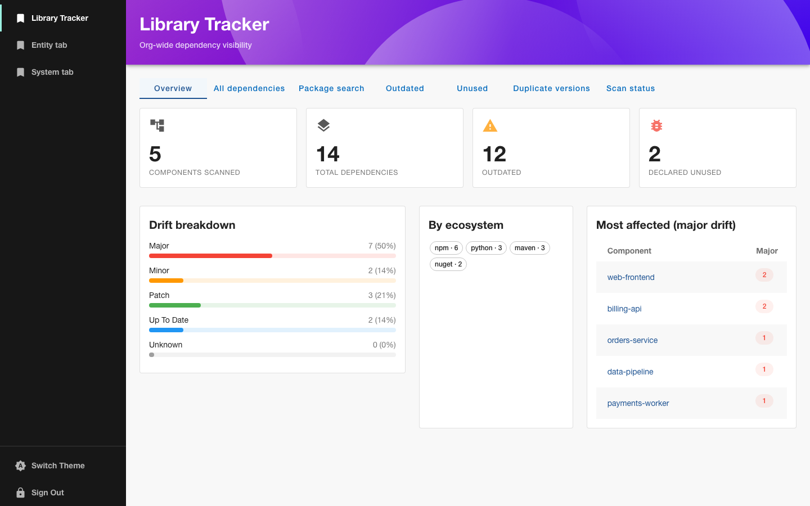
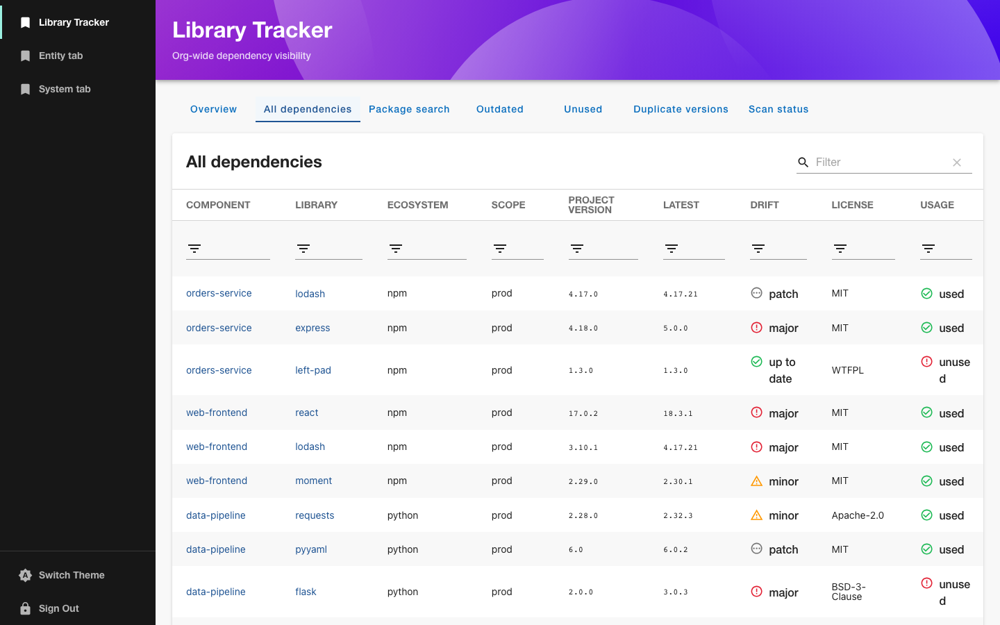
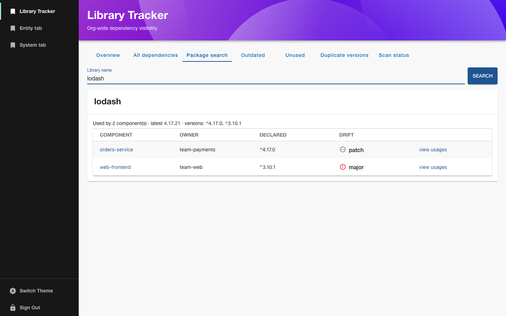
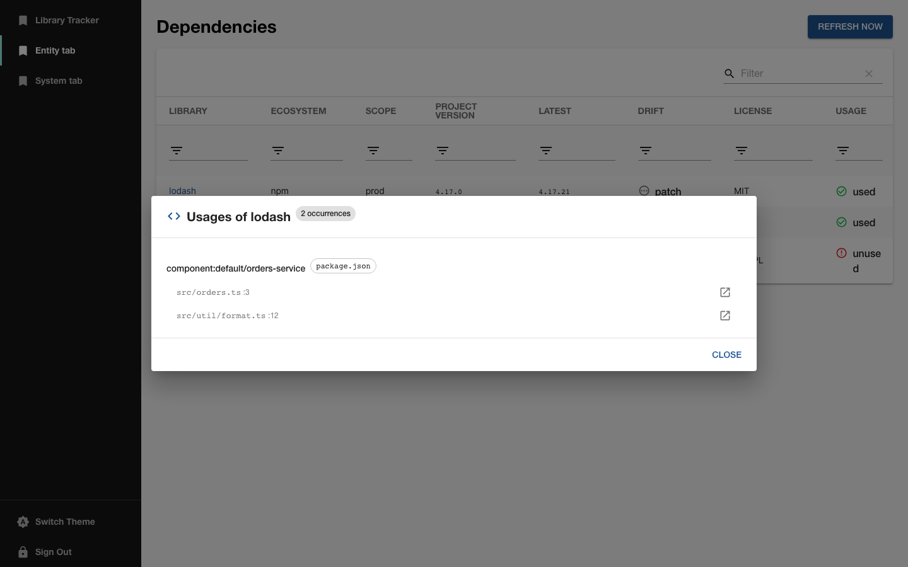
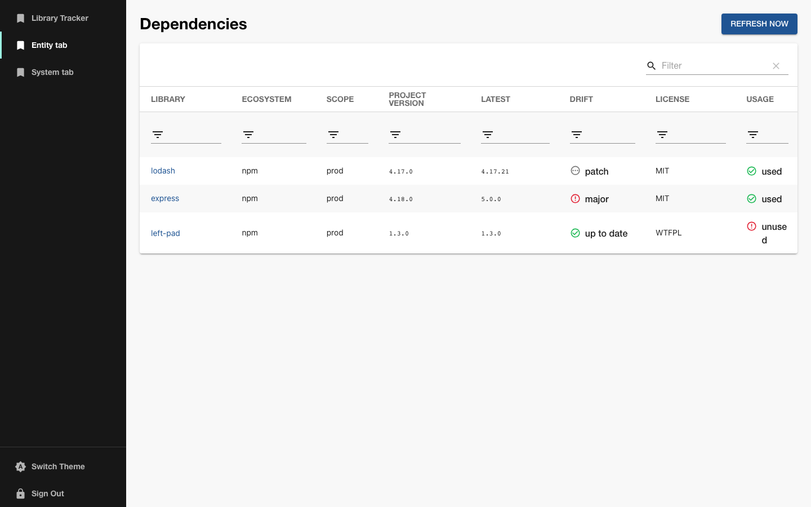
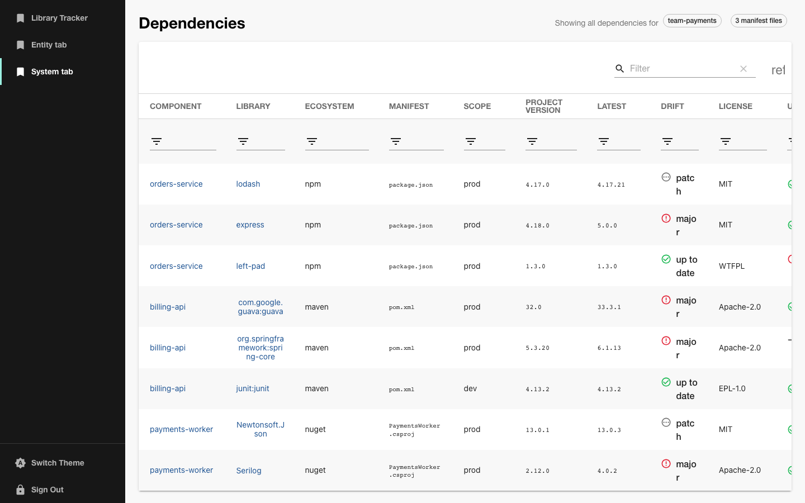
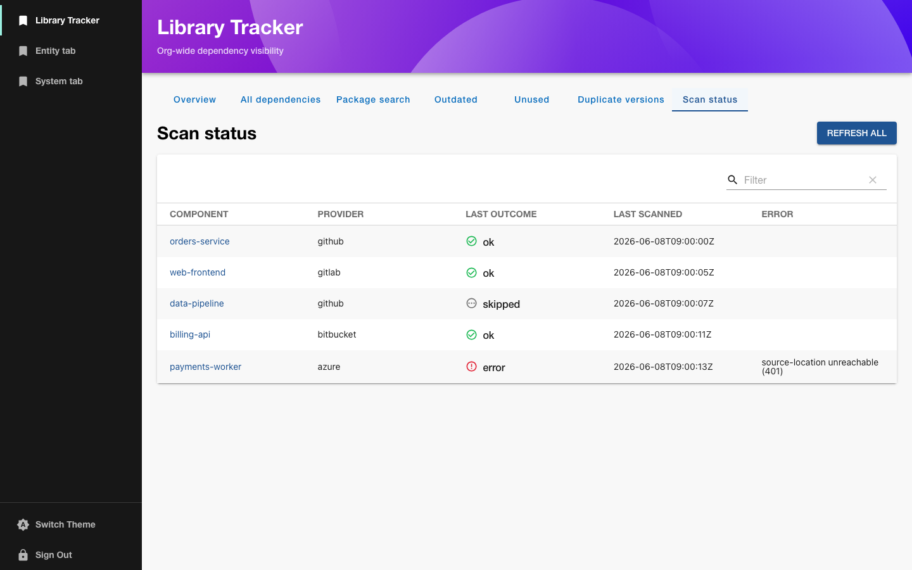
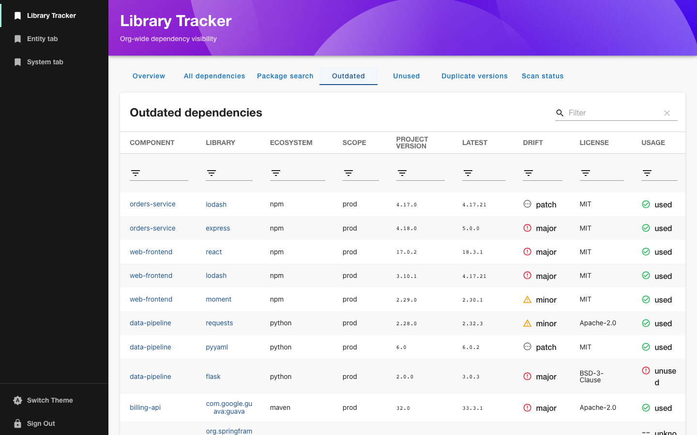
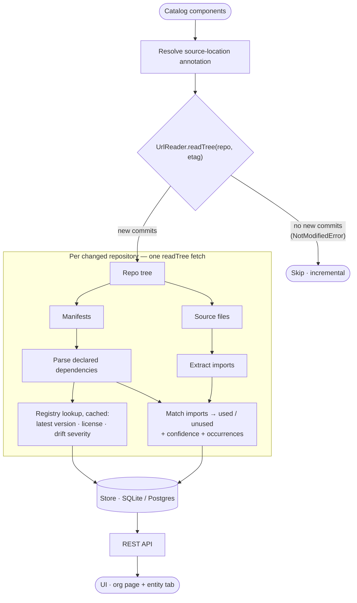

# 📚 Library Tracker for Backstage

> Organization-wide third-party dependency visibility — versions, drift, licenses, and unused
> dependencies — across every component in your catalog.


`backstage-plugin-library-tracker` resolves each `Component`'s repository from its catalog
`backstage.io/source-location` annotation and scans it **via VCS APIs only** — no cloning, built
entirely on Backstage's `UrlReaderService`, so it works uniformly across GitHub, GitLab,
Bitbucket and Azure DevOps.

It answers questions you can't easily get from any single registry or repo:

- 📦 **What does each component depend on, and at which versions?**
- 🔍 **Which components depend on library X?** — reverse search across the whole org.
- 📈 **How outdated is each dependency?** — severity-graded drift (major / minor / patch) plus license.
- 🧹 **Which declared dependencies are never imported?** — conservative, confidence-scored detection.
- 📍 **Where is a library actually imported?** — cross-provider code-occurrence viewer.
- ⚠️ **Where do versions conflict across the org?** — duplicate-version report.

Scans run on a schedule **and** on demand, and are **incremental**: the reader's ETag
(`NotModifiedError`) skips repositories with no new commits since the last sync, so re-scans are
cheap.



---

## Contents

- [Screenshots](#screenshots)
- [Supported ecosystems](#supported-ecosystems)
- [How it works](#how-it-works)
- [Install](#install)
- [Configuration](#configuration)
- [Views](#views)
- [REST API](#rest-api)
- [Local development](#local-development)
- [Accuracy & limitations](#accuracy--limitations)
- [Project layout](#project-layout)

---

## Screenshots

<table>
  <tr>
    <td width="50%" valign="top">
      <b>Overview dashboard</b> — stat cards, drift breakdown, ecosystem chips, and top-affected table.
      
    </td>
    <td width="50%" valign="top">
      <b>All dependencies</b> — org-wide table with clean "Project version" display and drift badges.
      
    </td>
  </tr>
  <tr>
    <td width="50%" valign="top">
      <b>Reverse search</b> — which components depend on a library, and at which versions.
      
    </td>
    <td width="50%" valign="top">
      <b>Code-occurrence viewer</b> — exact files and lines where a library is imported, with source links.
      
    </td>
  </tr>
  <tr>
    <td width="50%" valign="top">
      <b>Entity tab</b> — one component's dependencies with on-demand rescan.
      
    </td>
    <td width="50%" valign="top">
      <b>System tab</b> — aggregated dependencies for all components owned by a team.
      
    </td>
  </tr>
  <tr>
    <td width="50%" valign="top">
      <b>Scan status</b> — per-component scan state across providers, including skips and errors.
      
    </td>
    <td width="50%" valign="top">
      <b>Outdated report</b> — dependencies behind latest, graded by drift severity.
      
    </td>
  </tr>
</table>

The **Unused** and **Duplicate versions** tabs present the same data filtered for each report.

## Supported ecosystems

| Ecosystem        | Manifests                                        | Registry (latest + license) | Unused detection                             |
| ---------------- | ------------------------------------------------ | --------------------------- | -------------------------------------------- |
| **npm / Node**   | `package.json`                                   | registry.npmjs.org          | ✅ high confidence                           |
| **Python**       | `requirements*.txt`, `pyproject.toml`, `Pipfile` | PyPI                        | ✅ high confidence                           |
| **Maven / Java** | `pom.xml`                                        | Maven Central               | ⚠️ used-only ([why](#accuracy--limitations)) |
| **NuGet / C#**   | `*.csproj`, `packages.config`                    | api.nuget.org               | ⚠️ used-only ([why](#accuracy--limitations)) |

New ecosystems plug in behind a single [`EcosystemParser`](packages/backend/src/ecosystems/types.ts)
interface.

## How it works



A **single `readTree` per changed repo** yields both the manifests and the source files, so
manifest parsing and unused-dependency analysis share one fetch. The ETag check skips unchanged
repos, and everything downstream is concurrency-limited.

## Install

Install into an existing Backstage app:

```bash
# backend
yarn --cwd packages/backend add backstage-plugin-library-tracker-backend
# frontend
yarn --cwd packages/app add backstage-plugin-library-tracker
```

**Backend** — `packages/backend/src/index.ts`:

```ts
backend.add(import('backstage-plugin-library-tracker-backend'));
```

**Frontend — org-wide page** — `packages/app/src/App.tsx`:

```tsx
import { LibraryTrackerPage } from 'backstage-plugin-library-tracker';

<Route path="/library-tracker" element={<LibraryTrackerPage />} />;
```

**Frontend — entity tab** — `packages/app/src/components/catalog/EntityPage.tsx`:

```tsx
import {
  EntityLibraryTrackerContent,
  SystemLibraryTrackerContent,
  LibraryTrackerIcon,
} from 'backstage-plugin-library-tracker';

// Component entity page
<EntityLayout.Route path="/dependencies" title="Dependencies">
  <EntityLibraryTrackerContent />
</EntityLayout.Route>

// System entity page
<EntityLayout.Route path="/dependencies" title="Dependencies">
  <SystemLibraryTrackerContent />
</EntityLayout.Route>
```

**Frontend — sidebar icon** — `packages/app/src/components/Root/Root.tsx`:

```tsx
import { LibraryTrackerIcon } from 'backstage-plugin-library-tracker';

<SidebarItem icon={LibraryTrackerIcon} to="library-tracker" text="Library Tracker" />
```

> 💡 Add SCM [`integrations`](https://backstage.io/docs/integrations/) to `app-config.yaml` so the
> reader can reach private repos and enjoy higher rate limits. Components are scanned only if they
> carry a `backstage.io/source-location` (or `backstage.io/managed-by-location`) annotation.

## Configuration

All keys are optional; defaults are shown.

```yaml
libraryTracker:
  schedule: # how often the org-wide scan runs
    frequency: { hours: 6 }
    timeout: { minutes: 30 }
    initialDelay: { seconds: 30 }
  scan:
    concurrency: 5 # repositories scanned in parallel
    excludePaths: [node_modules, target, dist, .venv, vendor] # defaults cover more
  registry:
    enableVersionCheck: true # look up latest versions + licenses (disable to skip all registry calls)
    cacheTtl: { hours: 24 } # how long registry lookups are cached
```

| Key                           | Default           | Description                                            |
| ----------------------------- | ----------------- | ------------------------------------------------------ |
| `schedule`                    | every 6h          | Standard Backstage task schedule for the org-wide scan |
| `scan.concurrency`            | `5`               | Max repositories processed in parallel                 |
| `scan.excludePaths`           | build/vendor dirs | Directory names skipped while scanning                 |
| `registry.enableVersionCheck` | `true`            | Fetch latest version + license from public registries  |
| `registry.cacheTtl`           | `24h`             | TTL for cached registry lookups                        |

## Views

The org-wide page (`LibraryTrackerPage`) is tabbed:

| Tab                    | What it shows                                                                                     |
| ---------------------- | ------------------------------------------------------------------------------------------------- |
| **Overview**           | Stat cards, colour-coded drift breakdown, ecosystem distribution, top-affected-by-major-drift table |
| **All dependencies**   | Every dependency org-wide, filterable by ecosystem / owner / drift / usage                        |
| **Package search**     | Reverse lookup: which components use a library, at which versions                                 |
| **Outdated**           | Dependencies behind latest, graded major / minor / patch                                          |
| **Unused**             | Declared-but-never-imported dependencies                                                          |
| **Duplicate versions** | Same library pinned to conflicting versions across the org                                        |
| **Scan status**        | Per-component scan state + a **Refresh all** button                                               |

The **entity tab** (`EntityLibraryTrackerContent`) shows one component's dependencies with a
**Refresh now** button. Every library name opens a **code-occurrence dialog** with the exact files
and lines where it's imported, each with a direct link to the source file in the VCS.

The **system tab** (`SystemLibraryTrackerContent`) aggregates all dependencies for every component
owned by the system's team, with a **Manifest** column that appears automatically when multiple
manifest files are present:

```tsx
import { SystemLibraryTrackerContent } from 'backstage-plugin-library-tracker';

<EntityLayout.Route path="/dependencies" title="Dependencies">
  <SystemLibraryTrackerContent />
</EntityLayout.Route>
```

## REST API

Mounted at `/api/library-tracker`:

| Method & path                                                                    | Purpose                                               |
| -------------------------------------------------------------------------------- | ----------------------------------------------------- |
| `GET /dependencies?ecosystem=&owner=&severity=&unused=&outdated=&offset=&limit=` | Filtered, paginated list                              |
| `GET /entities/:namespace/:kind/:name/dependencies`                              | One component's dependencies                          |
| `GET /libraries/lookup?name=`                                                    | Reverse search (components + versions)                |
| `GET /libraries/occurrences?name=&entityRef=`                                    | Files/lines importing a library                       |
| `GET /reports/overview`                                                          | Aggregate stats for the Overview dashboard            |
| `GET /reports/duplicates`                                                        | Conflicting versions across the org                   |
| `GET /reports/unused`                                                            | Declared-but-unused dependencies                      |
| `GET /reports/outdated?severity=`                                                | Outdated dependencies, optionally by severity         |
| `GET /scan/status` · `GET /scan/runs`                                            | Scan state and run history                            |
| `POST /scan/refresh` `{ entityRef? }`                                            | On-demand rescan (one component, or all when omitted) |

## Local development

Each package ships a standalone dev harness — **no host app required**.

```bash
yarn install
yarn tsc          # emit declaration files into dist-types/

# in separate terminals:
yarn workspace backstage-plugin-library-tracker-backend start   # dev backend on :7007 (mock catalog)
yarn workspace backstage-plugin-library-tracker start           # dev frontend
```

Trigger a scan and inspect the results:

```bash
curl -XPOST localhost:7007/api/library-tracker/scan/refresh
curl 'localhost:7007/api/library-tracker/dependencies' | jq
```

Quality gates:

```bash
yarn tsc && yarn build   # type-check + build all packages
yarn lint                # lint all packages
CI=true yarn test        # run all tests once (omit CI for watch mode)
```

## Accuracy & limitations

Unused-dependency detection is intentionally **conservative** — a dependency is flagged
`unused` only when confidence clears a threshold:

- **npm / Python** — the package name maps reliably to its import name (with a small alias table
  for cases like `PyYAML → yaml`), so both presence and absence of an import are trustworthy.
- **Maven / NuGet** — a package id only loosely maps to the imported namespace, and reflection,
  dependency injection and code generation routinely hide real usage. These are reported as
  **used** when an import matches, but are **never auto-flagged as unused** (shown as _unknown_
  instead) to avoid false positives.

Scanning requires a readable `source-location`; `file:` and unreadable locations are skipped and
surfaced in **Scan status**.

## Project layout

| Package                                                        | Role                                                     |
| -------------------------------------------------------------- | -------------------------------------------------------- |
| [`backstage-plugin-library-tracker-common`](packages/common)   | Isomorphic types and API DTOs                            |
| [`backstage-plugin-library-tracker-backend`](packages/backend) | Scanner, scheduler, store, REST API (new backend system) |
| [`backstage-plugin-library-tracker`](packages/frontend)        | Org-wide page + entity tab (frontend plugin)             |

## License

Apache-2.0
